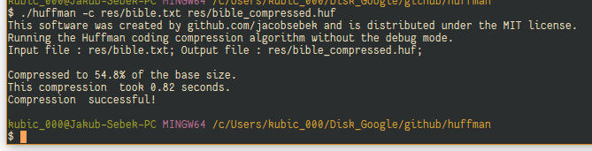

# Huffman
Huffman is my simple text file compressor/decompressor. It uses the technique of [Huffman coding](https://en.wikipedia.org/wiki/Huffman_coding "Wikipedia Article") by *David A. Huffman*. 
For example, it is capable of losslessely compressing English text to about half the size and genomes up to the quarter of the original size, making it *always* optimal.
(However, not that for very small files, the compressed version may even be bigger than the original)



## Compilation
If you are using Windows, you can download the binary executable from [releases](../../releases).  
The program is compatible with C99 and uses only the standard library, plugging it into your compiler of choice should be enough (let me know about any issues). 
You can compile it with GCC on *nix systems or MinGW on Windows (with an `.exe`extension, of course) with:
```
gcc src/*.c -Iinclude -o ./huffman
```

## Usage
The program always needs three parameters, in this exact order:
1.  "-c" : Compress the input file, output to the output file  
    "-ci" : "-c" with debug information  
    "-d" : Decompress the input file, output to the output file  
    "-di" : "-d" with debug information
2. Input file
3. Output file  

For example, to compress the file `file.txt` and output to the file `output.txt`, you would use:
```
huffman -c file.txt output.txt
```
For a more detailed description, check out [the documentation file](<doc/Stage 1/doc.txt>).
